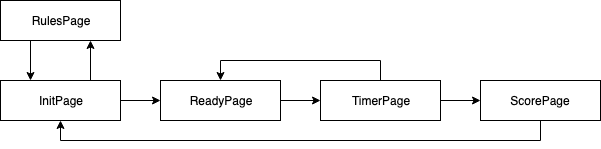

# Russian Hat

A Flutter project for the Flutter Create contest.

## Description

[Russian Hat](https://ru.wikipedia.org/wiki/%D0%A8%D0%BB%D1%8F%D0%BF%D0%B0_(%D0%B8%D0%B3%D1%80%D0%B0)) is an intellectual team game (close analog is Alias). Particiants split into two teams and play several rounds. In each round a team choose a lead player who will describe words on the screen using only gestures. Other teammates have to guess this word. Oponent team keep quiet and wait for turn.

App includes handmade flare images with animation and exclusive music by Andrey Chernoprudov!

## Implementation

Code implementation uses the state machine as a business logic driver and actions to change a state.

